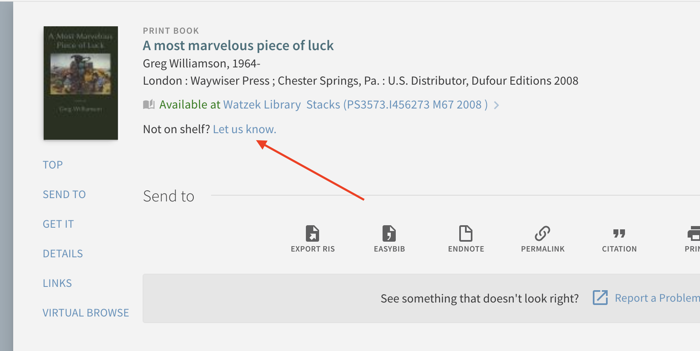

# primo-explore-not-on-shelf
Provides a link to an external page/form with title, author, location, and call number. Library staff can then use this information for searches.

## Features
Creates a link underneath the Real Time Availability in the Primo Explore full display for a record. Link is designed to include author, title, call number, and location.

### Screenshot


## Install
1. Make sure you've installed and configured [primo-explore-devenv](https://github.com/ExLibrisGroup/primo-explore-devenv).
2. Navigate to your template/central package root directory. For example:
    ```
    cd primo-explore/custom/MY_VIEW_ID
    ```
3. If you do not already have a `package.json` file in this directory, create one:
    ```
    npm init -y
    ```
4. Install this package:
    ```
    npm install primo-explore-not-on-shelf --save-dev
    ```
5. Generate an ILLiad Web Platform API Key, as described [here](https://prometheus.atlas-sys.com/display/illiad/The+ILLiad+Web+Platform+API).

6. Deploy the php file to a server accessible to you. Edit lines 7, 10, and 11.

7. Place the .htaccess file in the same directory as your PHP file to add CORS authorization. Note: if CORS is still an issue, please visit [this page](https://awesometoast.com/cors/) for further solutions to get this working.

## Usage
Once this package is installed, add `my-ill` as a dependency for your custom module definition.

```js
var app = angular.module('viewCustom', ['myILL'])
```

Note: If you're using the `--browserify` build option, you will need to first import the module with:

```javascript
import 'primo-explore-not-on-shelf';
```

You can configure the banner by passing a configuration object. All properties are required.

| name      | type         | usage                                                                                   |
|-----------|--------------|-----------------------------------------------------------------------------------------|
| `libs` | array       | Whitelist of library codes for which the links should appear                                               |
| `urlBase` | string       | Base url for link. This can include additional GET parameters as needed.                                               |
| `query_mappings` | object       | Maps the GET URL fields for title, author, callnumber, location. For example, if you want your final URL to have the title value associated with "myTitle" (resulting in a URL parameter ...&myTitle=TheItemTitle&....), then the title portion of the object should read: 'title' : 'myTitle'.                                               |


The code below adds a banner similar to the above image.

```js
app.value('notOnShelfOptions', {
  "libs": ["Watzek"],
  "urlBase": "https://docs.google.com/forms/d/e/1FAIpQLSdBvdqmK0z1mHhg-ATiCHT94JVBuwdaaHzpyZJcK3XBGEP-IA/viewform?usp=pp_url",
  "query_mappings" : {
    'title': 'entry.956660822',
    'author': 'entry.1791543904',
    'callnumber': 'entry.865809076',
    'location': 'entry.431935401'
  }
})
```

<!-- ## Running tests
1. Clone the repo
2. Run `npm install`
3. Run `npm test` -->
